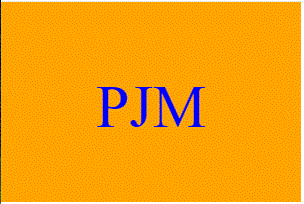

# Password Generator
Module 10 Challenge

## Description

This repository will produce an SVG-formatted file.  A user answers questions at a set of prompts which uses the results to draw one of three shapes, a square, cirle, or triangle, in a color of user's choosing with a three-letter monogram.  

Included is a set of Jest tests (test/shapes.test.js) to confirm accurate results of methods.

## Installation

Contains
  index.js containing classes for each shape
  one image file under directory assets/images which is not used within the website\

## Screenshot

## Video presentation
A demonstration of the use of the program can be found at https://youtu.be/_3kPnmUf6zg

## Repository
https://github.com/petemaynard/SVG-Logo-Maker

## Credits

Created by Pete Maynard
with some assistance from tutor Andrew Hardemon

